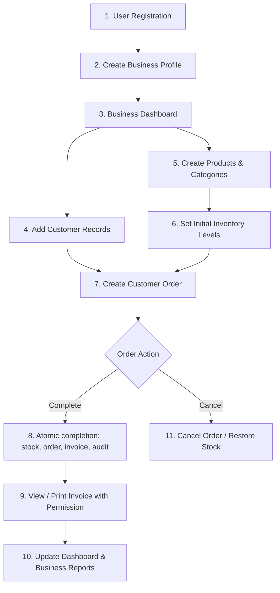
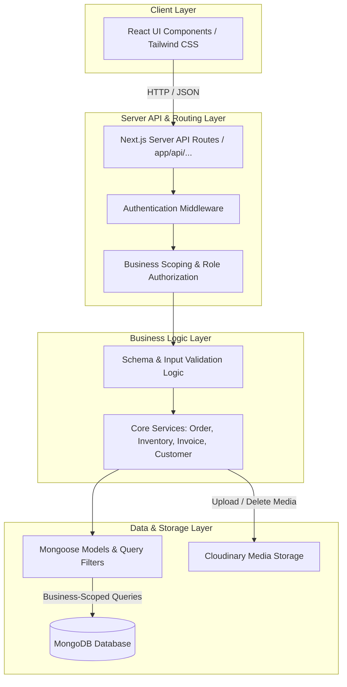
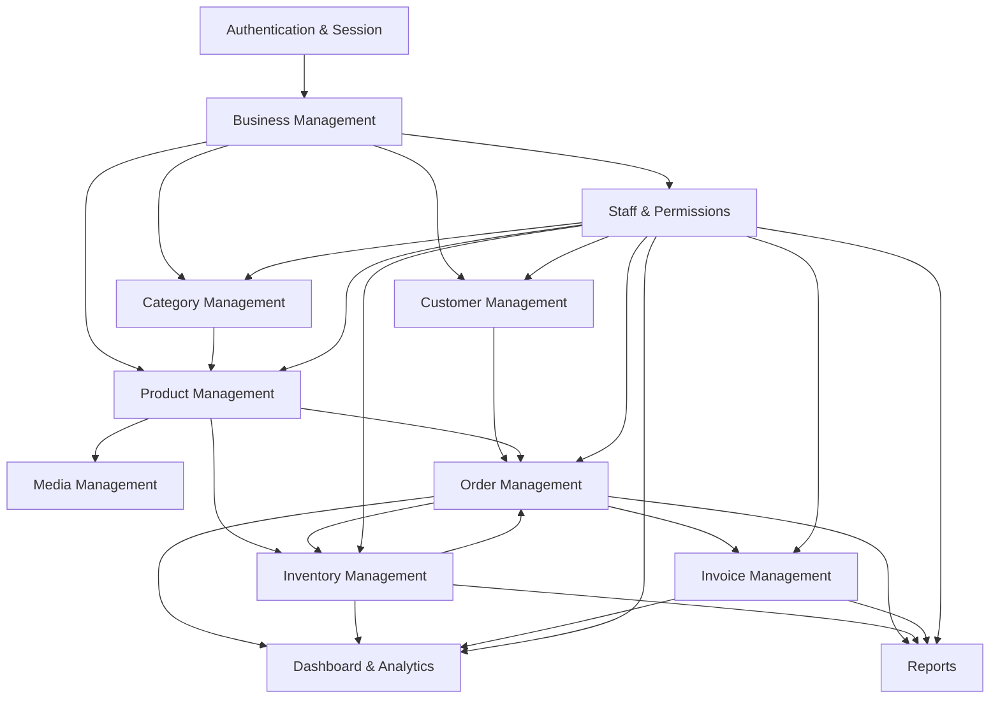
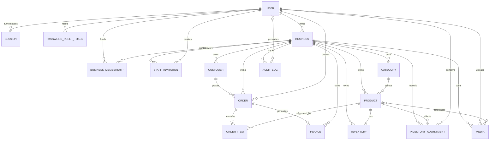
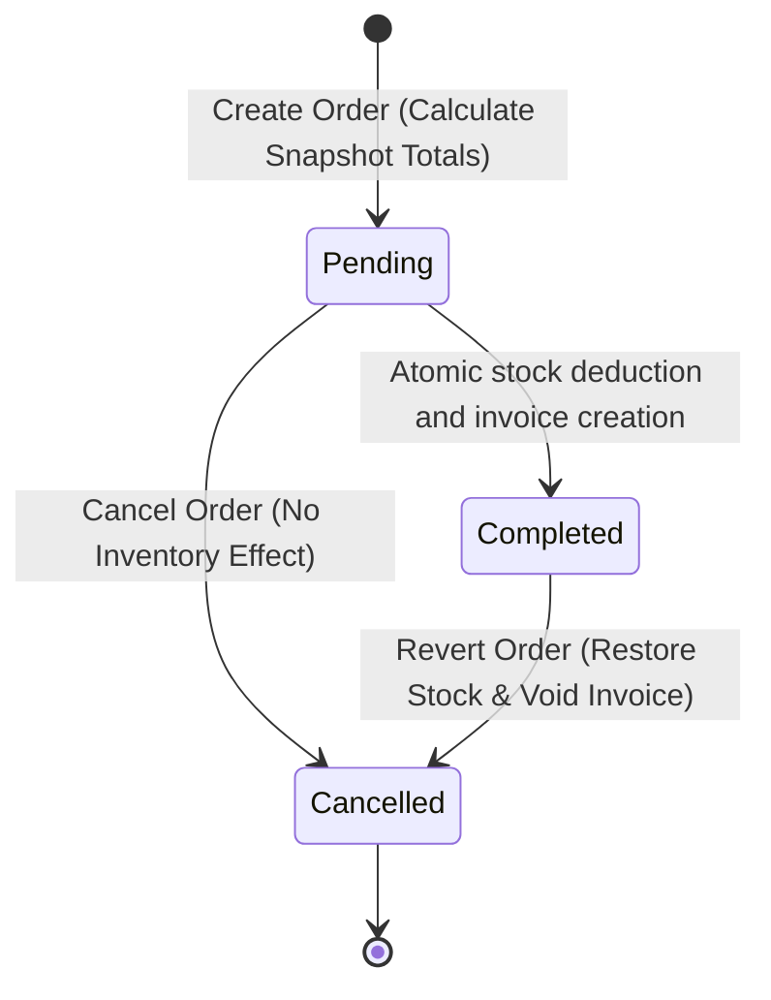
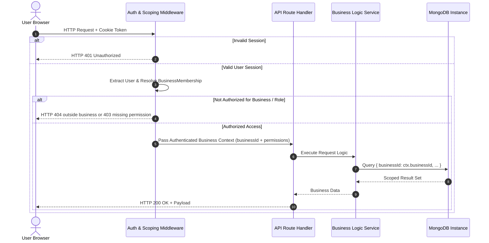
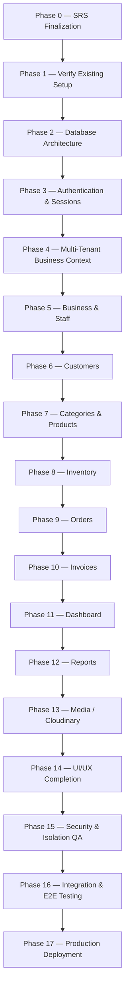

# Software Requirements Specification (SRS)

## BizFlow — Business Management Platform

**Document Version:** 1.1.1\
**Project Type:** Full-Stack Web Application\
**Project Status:** Revised Draft — Ready for Review\
**Tech Stack:** Next.js, React, TypeScript, Vanilla CSS / Tailwind CSS, MongoDB, Mongoose, Cloudinary

---

## Document Control

| Item                 | Value                                                                                                                  |
| :------------------- | :--------------------------------------------------------------------------------------------------------------------- |
| Document             | BizFlow Software Requirements Specification                                                                            |
| Version              | 1.1.1                                                                                                                  |
| Status               | Revised Draft — Ready for Review                                                                                   |
| Scope                | MVP                                                                                                                    |
| Primary Architecture | Next.js full-stack, MongoDB/Mongoose, Cloudinary                                                                       |
| Revision Focus       | Feature definitions, data consistency, permissions, invitation lifecycle, inventory history, order rules, and diagrams |

### Revision Notes

- Added a formal Core Feature Overview.
- Added Category Management as a first-class business-scoped module.
- Added staff invitation lifecycle and explicit MVP permission set.
- Added InventoryAdjustment and StaffInvitation entities.
- Clarified Pending order editing and immutable Completed/Cancelled orders.
- Corrected the module dependency diagram and expanded the ERD.
- Clarified tenant-scoped indexing and archive rules.
- Replaced date-bound roadmap entries with dependency-ordered implementation phases.
- Revision 1.1.1: corrected duplicate Invoice requirement IDs and feature numbering.
- Aligned invoice generation with automatic, atomic order completion throughout the document.
- Added formal Audit requirements, product listing requirements, and complete API coverage.
- Aligned permissions, invoice snapshots, archive/restore rules, and tenant-scoped indexes.
- Phase 1 verifies the existing connected repository instead of recreating it.
- This revision is complete for review; stakeholder approval and implementation tests remain pending.

---

## 1. Introduction

### 1.1 Purpose

This Software Requirements Specification (SRS) document details the complete functional, non-functional, data, architectural, security, and interface requirements for **BizFlow**. It serves as the definitive reference for developers, system architects, and stakeholders before and during implementation.

### 1.2 Scope

BizFlow is a full-stack, multi-tenant web application designed to centralize core daily operations for small and growing businesses. The platform enables independent businesses (e.g., retail, electronics, cosmetics, online stores, service-based businesses, and small agencies) to manage customers, catalog products, track inventory, process orders, and issue invoices within a single system, while ensuring strict logical data isolation between businesses.

### 1.3 Definitions & Acronyms

- **Multi-Tenancy / Business Data Isolation:** Architecture where multiple independent businesses share system infrastructure while keeping their operational data strictly isolated.
- **MVP:** Minimum Viable Product — the baseline functional version required for initial deployment.
- **SRS:** Software Requirements Specification.
- **Business Owner:** User with full operational and administrative privileges within a single business.
- **Staff Member:** User with constrained, configurable operational permissions within a single business.
- **Platform Administrator:** Conceptual system-wide administrator role reserved for future platform maintenance.

### 1.4 Project Objectives

- **Operational Unification:** Connect customer records, product catalogs, real-time inventory tracking, order fulfillment, and invoicing into one seamless workflow.
- **Strict Multi-Tenant Isolation:** Enforce server-side data scoping by `businessId` across all data queries and API endpoints.
- **Role-Based Governance:** Provide granular access control between Business Owners and Staff Members.
- **High Reliability:** Guarantee atomic inventory adjustments upon order status changes to avoid over-selling or stock drift.

---

## 2. Overall Description

### 2.1 Problem Statement & Solution

Small businesses frequently struggle with disconnected tools (spreadsheets, messaging apps, paper records), leading to:

- Out-of-sync inventory counts and stock-outs.
- Fragmented customer records and loss of transaction history.
- Slow, error-prone manual invoicing.
- Unsafe permission sharing where staff members get unrestricted access to sensitive data.

**BizFlow Solution:** A unified platform where businesses manage their complete lifecycle loop. Data remains isolated per business, operations are role-restricted, and stock updates automatically upon order fulfillment.

### 2.2 Core Business Operational Workflow

Every business onboarded to BizFlow follows a continuous operational loop:



### 2.3 User Classes & Characteristics

- **Business Owner:**
  - Highest authority within a specific business.
  - Responsible for business setup, profile settings, staff management, and full access to operational tools, dashboards, and financial reports.
- **Staff Member:**
  - Operational user invited by a Business Owner.
  - Access limited strictly to explicit permissions granted by the Owner (e.g., managing orders or viewing stock).
- **Platform Administrator (Future Scope):**
  - System administrator with platform-level monitoring capabilities; does not interfere with daily business data unless performing authorized maintenance.

### 2.4 Core Feature Overview

BizFlow MVP is organized into the following functional feature areas:

1. **Authentication & Account Security** — Registration, login, logout, password reset, and session management.
2. **Business Management** — Business profile, configuration, currency, and ownership.
3. **Staff & Permissions** — Staff invitations, membership lifecycle, configurable permissions, and access revocation.
4. **Customer Management** — Customer CRUD, search, filtering, purchase history, and archiving.
5. **Category Management** — Business-scoped product categories with active/archive lifecycle.
6. **Product Management** — Product CRUD, pricing, descriptions, category assignment, media, search, filtering, pagination, and archiving.
7. **Inventory Management** — Stock levels, manual adjustments, low-stock thresholds, adjustment history, and automated order deductions.
8. **Order Management** — Order creation, pending-order editing, price snapshots, fulfillment, cancellation, and stock reversal.
9. **Invoice Management** — Finalized invoices for completed orders, immutable totals, voiding, printing, and export.
10. **Dashboard & Analytics** — Revenue overview, recent orders, low-stock alerts, and permission-aware metrics.
11. **Reports** — Sales, inventory, and order activity reports over configurable date ranges.
12. **Media Management** — Validated Cloudinary uploads and business-scoped media records.
13. **Audit Logging** — Business-scoped records of important operational and administrative actions.

#### Authentication Policy Decisions

The MVP authentication system follows these rules:

1. User registration requires:
   - Full name
   - Valid email address
   - Password
   - Password confirmation
2. Email addresses are normalized before storage and authentication.
3. Email addresses are unique at the User level.
4. Passwords must never be stored in plain text.
5. Passwords must be securely hashed using bcrypt or an equivalent approved password-hashing algorithm.
6. Authentication uses a secure HTTP-only session cookie.
7. The session cookie must use:
   - HTTP-only
   - Secure in production
   - SameSite protection
   - Appropriate expiration
8. Login failures must return a generic authentication error and must not reveal whether an email address exists.
9. Logout invalidates the current authenticated session.
10. Password reset must use a secure, time-limited reset mechanism.
11. Password reset tokens must:
    - Be single-use
    - Expire after a defined period
    - Never be stored or exposed in plain text when persistent storage is required

12. The MVP does not include social login.
13. The MVP does not include multi-factor authentication unless added in a future scope revision.
14. Authentication state must be verified server-side before accessing protected business resources.

#### Business Ownership and Membership Rules

1. A registered user can create a business.
2. The user who creates a business becomes the Business Owner of that business.
3. The Business Owner has full access to the business's operational and administrative features defined by the permission model.
4. Staff members access a business through a BusinessMembership record.
5. Every business-scoped resource must contain a valid `businessId`.
6. A user must have a valid membership in a business before accessing that business's protected resources.
7. Business ownership cannot be changed through the normal staff-management interface.
8. Staff members cannot promote themselves to Business Owner.
9. Staff members cannot modify their own permissions.
10. Removing a staff member revokes their active access to the business.
11. A removed staff member must not be able to access business resources after their membership becomes inactive or revoked.
12. Cross-business resource access is prohibited.
13. A request containing a valid resource ID from another business must be rejected even when the authenticated user is otherwise valid.
14. The MVP does not include a user-facing multi-business account switcher.
15. Ownership transfer is outside the MVP unless explicitly added in a future SRS revision.
16. Platform Admin functionality is outside the MVP.

#### Customer Data Rules

1. Customers are scoped to a business using `businessId`.
2. A customer record cannot be accessed by another business.
3. Customer email addresses are normalized before comparison and storage when provided.
4. Customer email uniqueness is enforced within the same business.
5. The same email address may exist for customers belonging to different businesses.
6. Customer phone numbers are not globally unique.
7. Customers may be archived instead of physically deleted when historical orders depend on the customer record.
8. Archived customers must remain available to historical order and invoice records.
9. Archived customers should not appear in normal active-customer lists unless the user explicitly requests archived records.
10. Creating a new customer must validate all required fields on the server.
11. Customer search must be restricted to the authenticated user's current business.

#### Category Data Rules

1. Categories are scoped to a business using `businessId`.
2. Category names are normalized before duplicate checking.
3. Active category names must be unique within the same business.
4. The same category name may exist in different businesses.
5. Categories may be archived instead of physically deleted.
6. An archived category must remain available for historical product/order relationships where required.
7. Archived categories must not be available for assignment to newly created products.
8. A product already associated with an archived category must retain its historical category relationship unless the product is explicitly updated.
9. Category archive operations must be business-scoped and permission-protected.
10. Category creation, update, archive, and restore operations must be validated server-side.

#### Inventory Adjustment Rules

Inventory changes must be represented through controlled inventory adjustment records.

Supported adjustment types for the MVP are:

1. `INITIAL_STOCK`
   - Used when initial inventory is created for a product.
2. `MANUAL_INCREASE`
   - Used when stock is manually increased by an authorized user.
3. `MANUAL_DECREASE`
   - Used when stock is manually decreased by an authorized user.
4. `ORDER_DEDUCTION`
   - Used when a pending order is completed and inventory is deducted.
5. `ORDER_REVERSAL`
   - Used when a completed order is cancelled and previously deducted inventory is restored.

Each inventory adjustment must record:

- `businessId`
- `productId`
- Adjustment type
- Quantity change
- Stock before adjustment
- Stock after adjustment
- Reason or reference where applicable
- Related order ID when applicable
- User who performed or triggered the adjustment
- Creation timestamp

Inventory Rules:

1. Inventory quantity cannot become negative.
2. Manual inventory changes require appropriate permission.
3. Order deductions must occur atomically with order completion.
4. Order reversals must occur atomically with completed-order cancellation.
5. Inventory adjustments must not be silently overwritten.
6. Inventory history is append-oriented and must preserve previous adjustments.
7. Every inventory-changing operation must remain associated with the correct `businessId`.
8. Failed inventory transactions must not leave partially updated stock or order state.

#### Order Modification Rules

##### Pending Orders

A Pending order may be modified before completion.

The following may be changed while an order is Pending:

- Customer
- Products
- Quantities
- Order item composition
- Applicable order-level information allowed by the business rules

When an order item is changed:

1. Product existence must be verified.
2. Product must belong to the current business.
3. Current product information must be validated.
4. The order must recalculate its totals.
5. The final product price must be stored as a price snapshot on the order item.

##### Completed Orders

Once an order becomes Completed:

1. Its operational item data becomes immutable.
2. Its historical prices must not change when the related product price changes.
3. Its invoice becomes associated with the completed order.
4. Inventory deduction must already have been completed atomically.

##### Cancelled Orders

A Pending order may be cancelled without changing inventory.

A Completed order may be cancelled only through the defined cancellation workflow.

When a Completed order is cancelled:

1. The order status changes to Cancelled.
2. Previously deducted inventory is restored.
3. An `ORDER_REVERSAL` inventory adjustment is recorded.
4. The related invoice is voided.
5. The operation must be atomic.

A Cancelled order cannot be completed again.

A Completed or Cancelled order cannot return to Pending.

##### Cross-Business Protection

All order operations must verify that:

- The order belongs to the current business.
- Every referenced product belongs to the current business.
- The customer belongs to the current business when a customer is attached.
- Related inventory belongs to the current business.

Any cross-business reference must be rejected.


#### Invoice Rules

1. The system automatically creates one finalized invoice as part of the successful order-completion transaction. No separate Generate Invoice action is required.
2. Each invoice belongs to exactly one business.
3. Each invoice references exactly one order.
4. An order may have at most one invoice record, including a voided invoice; cancellation does not permit replacement invoices in the MVP.
5. Invoice totals are based on the finalized order data.
6. Invoice financial values must not change when the related product price changes later.
7. Finalized invoice totals are immutable.
8. An invoice cannot be edited as a normal business record after finalization.
9. A completed order's invoice may be voided when the completed order is cancelled according to the order cancellation workflow.
10. A voided invoice remains available for historical and audit purposes.
11. Invoice numbers must be unique within the business.
12. The completion workflow sets the order to Completed and creates its invoice inside the same database transaction; neither becomes visible until the transaction commits.
13. If invoice creation fails, the entire completion transaction rolls back, including stock deductions, adjustment records, order status, and audit records.
14. Invoice access must be restricted to users with the appropriate business permission.
15. The MVP invoice output must support a printable invoice view.
16. PDF generation/export is included only if implemented within the MVP implementation scope; otherwise printable HTML is the required MVP output.
17. Invoice records must retain the business, order, customer, item, quantity, price, subtotal, total, status, and relevant timestamps required for historical reconstruction.

#### Required Audit Events

The following events must be considered auditable actions within the MVP:

#### Authentication Events

- Successful login
- Failed login
- Logout
- Password reset request
- Password reset completion

#### Business Events

- Business creation
- Business configuration update

#### Staff Events

- Staff invitation created
- Staff invitation accepted
- Staff invitation revoked
- Staff member removed
- Staff permission changed

#### Customer Events

- Customer created
- Customer updated
- Customer archived
- Customer restored

#### Category Events

- Category created
- Category updated
- Category archived
- Category restored

#### Product Events

- Product created
- Product updated
- Product archived
- Product restored

#### Inventory Events

- Initial stock created
- Manual stock increase
- Manual stock decrease
- Order stock deduction
- Order stock reversal

#### Order Events

- Order created
- Order updated
- Order completed
- Order cancelled

#### Invoice Events

- Invoice generated
- Invoice voided

Each audit record should contain, where applicable:

- `businessId`
- Acting user ID
- Action type
- Entity type
- Entity ID
- Relevant metadata
- Timestamp

Business audit records must be business-scoped and must not expose data belonging to another business. Authentication events that occur before a business context exists use a separate account-level scope with no businessId; they are excluded from business audit queries. Failed or unknown-account login attempts may have no userId and must never store submitted passwords or raw tokens.

Audit records are intended for traceability and must not be silently modified as part of normal business operations.

### 2.5 Role Permission Matrix

| Operational Capability              | Business Owner | Staff Member (Configurable) | Platform Admin (Future) |
| :---------------------------------- | :------------: | :-------------------------: | :---------------------: |
| Create & Manage Business Profile    |     **Yes**    |            **No**           |          **No**         |
| Invite & Manage Staff / Permissions |     **Yes**    |            **No**           |          **No**         |
| Customer Management (CRUD)          |     **Yes**    |        Optional Grant       |          **No**         |
| Product & Category Management       |     **Yes**    |        Optional Grant       |          **No**         |
| Inventory Adjustments               |     **Yes**    |        Optional Grant       |          **No**         |
| Order Processing & Fulfillment      |     **Yes**    |        Optional Grant       |          **No**         |
| Invoice View & Print/Export         |     **Yes**    |        Optional Grant       |          **No**         |
| View Business Dashboard & Analytics |     **Yes**    |        Optional Grant       |          **No**         |
| View Business Reports              |     **Yes**    |        Optional Grant       |          **No**         |
| View Business Audit History         |     **Yes**    |            **No**           |          **No**         |
| Platform-Level System Monitoring    |     **No**     |            **No**           |         **Yes**         |
| Access Cross-Business Data          |     **No**     |            **No**           |   Restricted / Audited  |

---

## 3. Functional Requirements

### 3.1 Authentication & Session Management

- **REQ-AUTH-01:** System shall support user registration via email and password.
- **REQ-AUTH-02:** System shall securely hash passwords using `bcrypt` (or equivalent algorithm) prior to storage.
- **REQ-AUTH-03:** System shall authenticate user credentials and issue an opaque session token in an HTTP-only cookie, backed by a revocable server-side Session record. Store only a token hash; use Secure in production, SameSite protection, and a defined expiration.
- **REQ-AUTH-04:** Generic error messages shall be returned on failed logins to prevent account enumeration.
- **REQ-AUTH-05:** System shall provide explicit logout mechanisms that invalidate session state.
- **REQ-AUTH-06:** System shall support time-limited, single-use password reset tokens sent via email, store only token hashes, and invalidate existing sessions after a successful password reset.
- **REQ-AUTH-07:** Registration and login shall normalize email addresses and enforce global user-email uniqueness. Password reset requests shall return a generic response whether the account exists or not.
- **REQ-AUTH-08:** Authentication and reset endpoints shall enforce server-side validation and rate limits. Cookie-authenticated mutations shall reject untrusted origins or use equivalent CSRF protection.

### 3.2 Business Profile Management

- **REQ-BIZ-01:** Authenticated users without a business shall be directed to create a business profile (Name, Type, Currency, Contact details).
- **REQ-BIZ-02:** The user who creates a business automatically becomes its **Business Owner**; business creation and the Owner membership are saved atomically.
- **REQ-BIZ-03:** Every business-scoped resource (BusinessMembership, StaffInvitation, Customer, Category, Product, Inventory, InventoryAdjustment, Order, Invoice, Media, and business AuditLog) must reference exactly one valid `businessId`. User, Session, PasswordResetToken, and account-level authentication audit records are account-scoped exceptions.
- **REQ-BIZ-04:** Only Business Owners may modify profile details and business configuration settings.

### 3.3 User & Staff Management

- **REQ-STAFF-01:** Business Owners shall be able to create staff invitations using a staff member's email address.
- **REQ-STAFF-02:** Staff invitations shall support the lifecycle states `Pending`, `Accepted`, `Expired`, and `Revoked`.
- **REQ-STAFF-03:** Business Owners shall grant granular permissions from the approved permission set to Staff Members.
- **REQ-STAFF-04:** Staff Members shall not self-elevate permissions or manage other staff accounts.
- **REQ-STAFF-05:** Removing a Staff Member immediately revokes their access to the business without corrupting historical transaction logs created by them.
- **REQ-STAFF-06:** Staff membership and invitation records shall remain business-scoped and shall not permit cross-business access.
- **REQ-STAFF-07:** Invitation acceptance shall require an authenticated user whose normalized email matches the invitation, a valid single-use token, and an unexpired Pending invitation. Acceptance creates or activates a Staff membership atomically; expired or revoked invitations cannot grant access.

**Approved Staff Permission Set:**

- `canManageCustomers`
- `canManageCategories`
- `canManageProducts`
- `canManageInventory`
- `canManageOrders`
- `canManageInvoices`
- `canViewReports`
- `canViewDashboard`

### 3.4 Customer Management

- **REQ-CUST-01:** System shall support Create, Read, Update, and Deactivate/Archive operations for customer records.
- **REQ-CUST-02:** Customer records must store contact details, addresses, notes, and link to their purchase history.
- **REQ-CUST-03:** Customer records referenced in existing orders cannot be hard-deleted; they must be deactivated/archived.
- **REQ-CUST-04:** Customer search and filtering (by name, phone, email) must strictly operate within the active business context.
- **REQ-CUST-05:** A provided customer email shall be normalized and unique within its business, including archived records; absent email addresses do not participate in uniqueness checks.
- **REQ-CUST-06:** Authorized users may restore archived customers. Historical relationships remain intact, and archived customers cannot be selected for new orders.

### 3.5 Category Management

- **REQ-CAT-01:** System shall allow authorized users to create, read, update, and archive product categories within the active business.
- **REQ-CAT-02:** Normalized active category names shall be unique within a business context; restoring an archived category must reject conflicts with an active category.
- **REQ-CAT-03:** Categories referenced by products shall not be hard-deleted; they shall be archived or otherwise prevented from breaking historical product references.
- **REQ-CAT-04:** Category queries and mutations shall be strictly scoped to the active `businessId`.
- **REQ-CAT-05:** Authorized users may restore archived categories, subject to active-name uniqueness. New category assignments must reference an active category in the same business.

### 3.6 Product Management

- **REQ-PROD-01:** System shall allow authorized users to manage product records (Title, Description, Category, Price, Media references).
- **REQ-PROD-02:** Products referenced by existing orders cannot be hard-deleted; they must be archived to protect order history integrity.
- **REQ-PROD-03:** Product price modifications do not alter existing order/invoice price snapshots. New order items use the current price; explicitly edited Pending order items refresh their snapshots as defined in the order rules.
- **REQ-PROD-04:** Product lists shall support name search, category/status filtering, and pagination within the active business (default 20 items, maximum 100).
- **REQ-PROD-05:** Authorized users may restore archived products. New orders may only select active products; media and category references must belong to the same business.

### 3.7 Inventory Management

- **REQ-INV-01:** Each product must have a corresponding inventory stock level and optional low-stock threshold.
- **REQ-INV-02:** Inventory adjustments must be tracked in an inventory adjustment history. The system shall support the following adjustment types: `INITIAL_STOCK`, `MANUAL_INCREASE`, `MANUAL_DECREASE`, `ORDER_DEDUCTION`, and `ORDER_REVERSAL`.
- **REQ-INV-02A:** Each inventory adjustment record shall identify the product, business, quantity change, adjustment type, related order when applicable, acting user, and timestamp.
- **REQ-INV-03:** Transitioning an order to **Completed** must automatically and atomically decrement stock for all line items.
- **REQ-INV-04:** Completing an order that exceeds available stock must be blocked. Backorder overrides are outside the MVP.
- **REQ-INV-05:** Initial and manual stock changes shall atomically update inventory and append adjustment history; quantities must remain nonnegative and manual adjustments require canManageInventory.

### 3.8 Order Management

- **REQ-ORD-01:** Orders must link a customer to one or more business products with fixed snapshot prices and quantities.
- **REQ-ORD-02:** Supported order lifecycle states: `Pending`, `Completed`, `Cancelled`.
- **REQ-ORD-02A:** Pending orders may be edited before completion; Completed and Cancelled orders shall not be directly edited.
- **REQ-ORD-03:** Orders must reject line items belonging to other businesses or non-existent items.
- **REQ-ORD-04:** Cancelling a `Completed` order atomically restores stock quantities, appends ORDER_REVERSAL adjustments, sets the order to Cancelled, voids its invoice, and records the required audit events.
- **REQ-ORD-05:** Completion shall atomically validate and deduct stock, append adjustment history, set the order to Completed, create its invoice, and record required business audit events. Failure rolls back all writes.
- **REQ-ORD-06:** Retried or concurrent status changes shall never deduct/restore stock twice or create duplicate invoices. The service validates the current state and rejects invalid transitions with 409 Conflict.

### 3.9 Invoice Management

- **REQ-INVOICE-01:** The system shall automatically create an invoice in the same transaction that successfully completes an order. No manual invoice-generation endpoint is required in the MVP.
- **REQ-INVOICE-02:** Each order permits at most one invoice record, and invoice numbers shall be unique within each business.
- **REQ-INVOICE-03:** Finalized invoice snapshots and financial totals are immutable. Cancelling a completed order voids its invoice atomically without deleting the invoice or changing its historical values. Credit notes and reissue procedures are outside the MVP.
- **REQ-INVOICE-04:** Authorized users with canManageInvoices may view and print a formatted HTML invoice. PDF export is optional, not a required MVP acceptance condition.
- **REQ-INVOICE-05:** Invoices shall preserve business/customer details, line-item names, quantities, prices, subtotals, total, currency, and timestamps from finalization so later profile or product changes do not alter the historical invoice.

### 3.10 Dashboard & Business Analytics

- **REQ-DASH-01:** Owners and Staff with canViewDashboard shall access a dashboard displaying current business metrics (Recent Orders, Revenue Overview, Low-Stock Alerts).
- **REQ-DASH-02:** Dashboard widgets must filter content dynamically based on the active user's permissions.

### 3.11 Reports & Media Management

- **REQ-REP-01:** System shall generate sales, inventory turnover, and order activity reports over customizable date ranges.
- **REQ-MEDIA-01:** Media uploads (e.g., product images) shall be validated for file size/type before uploading to external cloud storage (Cloudinary).
- **REQ-MEDIA-02:** Media records shall be bound to businessId. Upload, read, assignment, and deletion operations require canManageProducts and must reject cross-business references. Sensitive media requires access-controlled delivery; a database scope alone does not protect a public Cloudinary URL.

### 3.12 Audit Logging

- **REQ-AUD-01:** The system shall record the Required Audit Events defined in Section 2.4.
- **REQ-AUD-02:** Business audit records shall contain businessId, the acting user, action, entity type/ID, relevant metadata, and timestamp. Account-level authentication events follow the explicit account-scope exception in Section 2.4.
- **REQ-AUD-03:** Audit history is append-only through normal application operations; no application endpoint shall update or delete audit records.
- **REQ-AUD-04:** Only Business Owners may read their business audit history, with pagination and action/entity/date filtering. Account-level authentication events are not exposed through business audit endpoints.
- **REQ-AUD-05:** Required audit events for committed business mutations shall be recorded in the same database transaction as those mutations. Logs shall exclude passwords, raw session/reset/invitation tokens, and unnecessary sensitive information.

---

## 4. System Architecture & High-Level Design

### 4.1 Layered Architecture Overview

BizFlow utilizes a Next.js full-stack architecture with strict server-side validation and multi-tenant scoping before any database execution:



### 4.2 Module Dependency Diagram



The dependency direction represents business capability dependencies, while authentication and staff permissions act as cross-cutting access controls.

### 4.3 Technology Stack

- **Frontend Framework:** Next.js (App Router), React, TypeScript.
- **Styling:** Vanilla CSS / Tailwind CSS (Responsive Design System).
- **Backend Runtime:** Next.js Server & API Routes (Full-Stack Unified Runtime).
- **Database Layer:** MongoDB with Mongoose Object Data Modeling (ODM).
- **Media Management:** Cloudinary API integration.
- **Deployment & Hosting:** Vercel platform with automated CI/CD integration.

---

## 5. Data Requirements & Database Schema

### 5.1 Multi-Tenancy Strategy

All business operational collections incorporate a mandatory businessId reference. Server-side business-context resolution must validate active membership before each operation, and the data-access layer must explicitly scope every business query and mutation to that verified businessId. Mongoose does not automatically enforce this rule. User, Session, PasswordResetToken, and account-level authentication audit records are account-scoped; the Business document is scoped by its own _id and validated membership.

### 5.2 Logical Entity Specifications

- **User:** `_id`, `email` (unique), `passwordHash`, `name`, `status`, `createdAt`.
- **Session:** `_id`, `userId` (ref: User), `tokenHash`, `expiresAt`, `revokedAt` (optional), `createdAt`.
- **PasswordResetToken:** `_id`, `userId` (ref: User), `tokenHash`, `expiresAt`, `usedAt` (optional), `createdAt`.
- **Business:** `_id`, `name`, `ownerId` (ref: User), `currency`, `businessType`, contact details, `createdAt`.
- **BusinessMembership:** `_id`, `userId` (ref: User), `businessId` (ref: Business), `role` (Owner|Staff), `permissions` (Array), `status`, `createdAt`, `updatedAt`.
- **StaffInvitation:** `_id`, `businessId` (ref: Business), `email`, `invitedBy` (ref: User), `permissions` (Array), `status` (Pending|Accepted|Expired|Revoked), `tokenHash`, `expiresAt`, `createdAt`.
- **Customer:** `_id`, `businessId` (ref: Business), `name`, `email`, `phone`, `address`, `notes`, `status` (Active|Archived), `createdAt`, `updatedAt`.
- **Category:** `_id`, `businessId` (ref: Business), `name`, `normalizedName`, `description`, `status` (Active|Archived), `createdAt`, `updatedAt`.
- **Product:** `_id`, `businessId` (ref: Business), `categoryId` (ref: Category), `name`, `description`, `price`, `mediaIds` (Array, refs: Media), `status` (Active|Archived), `createdAt`, `updatedAt`.
- **Inventory:** `_id`, `businessId` (ref: Business), `productId` (ref: Product, unique per business), `quantity`, `lowStockThreshold`, `updatedAt`.
- **InventoryAdjustment:** `_id`, `businessId` (ref: Business), `productId` (ref: Product), `userId` (ref: User), `type` (INITIAL_STOCK|MANUAL_INCREASE|MANUAL_DECREASE|ORDER_DEDUCTION|ORDER_REVERSAL), `quantityChange`, `previousQuantity`, `newQuantity`, `orderId` (optional ref: Order), `reason` (optional), `createdAt`.
- **Order:** `_id`, `businessId` (ref: Business), `customerId` (ref: Customer), `items` (Array of embedded OrderItems), `totalAmount`, `status` (Pending|Completed|Cancelled), `createdBy` (ref: User), `createdAt`, `updatedAt`.
- **OrderItem (Embedded):** `productId` (ref: Product), `productNameSnapshot`, `quantity`, `unitPriceAtOrder`, `lineTotal`.
- **Invoice:** `_id`, `businessId` (ref: Business), `orderId` (ref: Order, unique), `invoiceNumber`, `businessSnapshot`, `customerSnapshot`, `itemsSnapshot` (names, quantities, unit prices, line totals), `subtotal`, `totalAmount`, `currency`, `status` (Issued|Voided), `issuedAt`, `voidedAt` (optional).
- **Media:** `_id`, `businessId` (ref: Business), `publicId`, `url`, `mimeType`, `uploadedBy` (ref: User), `uploadedAt`.
- **AuditLog:** `_id`, `scope` (Business|Account), `businessId` (required for Business scope, absent for Account scope), `userId` (ref: User, optional for unidentified authentication attempts), `action`, `entityType`, `entityId` (when applicable), `details`, `timestamp`.

### 5.3 Entity Relationship Diagram



`OrderItem` is embedded inside `Order`; it is shown separately in the ERD only to make the relationship explicit. The Business-to-AuditLog relationship applies only to Business-scope records; Account-scope records have no business relationship. Invoice snapshots are embedded historical values.

### 5.4 Indexing & Soft-Delete Strategy

- **Tenant Scoping Indexes:** Business-scoped collections shall use indexes that support common `{ businessId, status }`, lookup, and date-based queries.
- **User Uniqueness:** Normalized User.email shall be globally unique.
- **Account Token Lookup:** Session and PasswordResetToken shall have unique tokenHash indexes and expiration indexes; services must check expiry/revocation explicitly rather than depend on delayed cleanup.
- **Customer Uniqueness:** A partial unique index on { businessId, email } shall apply only when a normalized nonempty email is present, including archived customers.
- **Business Membership:** `{ businessId, userId }` shall be unique to prevent duplicate membership records.
- **Inventory Uniqueness:** `{ businessId, productId }` shall be unique.
- **Category Uniqueness:** `{ businessId, normalizedName }` shall be unique for active categories.
- **Invoice Uniqueness:** orderId shall remain unique across Issued and Voided records; { businessId, invoiceNumber } shall also be unique.
- **Invitation Lookup:** Appropriate indexes shall support `{ businessId, email, status }` and invitation expiration checks.
- **Archiving Strategy:** Customers, Categories, and Products shall use an archive status when historical dependencies exist instead of physical deletion.

---

## 6. Business Rules & Access Control Logic

### 6.1 Order & Inventory State Transition Rules



- **RULE-01 (Inventory Deduction):** Stock is decremented only upon moving an order to `Completed`.
- **RULE-02 (Insufficient Stock):** An order cannot complete if `Inventory.quantity < RequestedQuantity`. Backorders are disabled in the MVP unless explicitly enabled by a future business configuration.
- **RULE-03 (Price Snapshotting):** Line items capture unit price at creation. Later product updates do not automatically change existing orders/invoices; explicitly changed Pending order items refresh their snapshots and totals according to Section 2.4.
- **RULE-04 (Invoice Immutability):** Invoices generated for completed orders cannot be directly edited. Reversals require voiding the invoice.
- **RULE-05 (Cross-Business Rejection):** Orders cannot reference products, customers, inventory, categories, or other resources associated with a different `businessId`.
- **RULE-06 (Pending Order Editing):** Only `Pending` orders may be edited. Once an order is `Completed` or `Cancelled`, its operational fields are immutable.
- **RULE-07 (Inventory History):** Every stock-changing operation shall create an `InventoryAdjustment` record within the same transaction when transactional stock logic applies.
- **RULE-08 (Staff Access):** Effective permissions are derived from the active BusinessMembership; invitation status alone does not grant operational access.
- **RULE-09 (Automatic Invoice):** canManageOrders authorizes the whole completion/cancellation transaction, including internal invoice creation/voiding. canManageInvoices controls invoice browsing and printing, not the internal completion operation.
- **RULE-10 (Snapshot Values):** Invoice snapshots and totals are copied from finalized order data and relevant business/customer details; later changes cannot alter them.

---

## 7. External Interface Requirements

### 7.1 User Interface (UI/UX) Requirements

- **Application Shell:** Sidebar navigation rendering modules based on user permissions.
- **State Feedback:**
  - **Loading States:** Skeleton loaders for table rows and cards during API fetch.
  - **Empty States:** Actionable placeholders when lists (Customers, Products, Orders) return 0 items.
  - **Error Alerts:** User-friendly toast notifications and inline form validation hints.
  - **Confirmations:** Modal dialogs for destructive actions (Archiving products, cancelling orders).
- **Responsive Layout:** Adaptive layouts supporting Mobile, Tablet, and Desktop screen widths.

### 7.2 Core REST API Specifications Summary

| Endpoint | Method | Role / Permission Required | Description |
| :--- | :---: | :--- | :--- |
| `/api/auth/register` | `POST` | Public | Register account |
| `/api/auth/login` | `POST` | Public | Create authenticated session |
| `/api/auth/logout` | `POST` | Authenticated User | Revoke current session |
| `/api/auth/me` | `GET` | Authenticated User | Read current user and membership context |
| `/api/auth/forgot-password` | `POST` | Public, rate-limited | Send single-use reset link; generic response |
| `/api/auth/reset-password` | `POST` | Valid reset token, rate-limited | Reset password and revoke existing sessions |
| `/api/businesses` | `POST` | Authenticated User | Create business and Owner membership |
| `/api/businesses/:businessId` | `GET` | Active Member | Read business profile |
| `/api/businesses/:businessId` | `PATCH` | Business Owner | Update business configuration |
| `/api/businesses/:businessId/staff` | `GET` | Business Owner | List memberships |
| `/api/businesses/:businessId/staff/:membershipId` | `PATCH/DELETE` | Business Owner | Change Staff permissions or revoke membership |
| `/api/businesses/:businessId/staff/invitations` | `GET/POST` | Business Owner | List/create invitations |
| `/api/businesses/:businessId/staff/invitations/:invitationId` | `PATCH` | Business Owner | Revoke Pending invitation |
| `/api/staff-invitations/accept` | `POST` | Authenticated matching Invitee | Accept valid token and activate membership |
| `/api/businesses/:businessId/customers` | `GET/POST` | canManageCustomers | List/search/create customers |
| `/api/businesses/:businessId/customers/:customerId` | `GET/PATCH/DELETE` | canManageCustomers | Read/update/archive customer; PATCH may restore |
| `/api/businesses/:businessId/categories` | `GET/POST` | canManageCategories; GET also for canManageProducts | List/create categories; product staff get read-only lookup |
| `/api/businesses/:businessId/categories/:categoryId` | `GET/PATCH/DELETE` | canManageCategories; GET also for canManageProducts | Read/update/archive/restore category |
| `/api/businesses/:businessId/products` | `GET/POST` | canManageProducts; GET also for canManageOrders or canManageInventory | Search/filter/page/create products; operational lookup is read-only |
| `/api/businesses/:businessId/products/:productId` | `GET/PATCH/DELETE` | canManageProducts; GET also for canManageOrders or canManageInventory | Read/update/archive/restore product |
| `/api/businesses/:businessId/inventory` | `GET` | canManageInventory; stock lookup also for canManageOrders | Read stock; order staff see required availability only |
| `/api/businesses/:businessId/inventory/:productId` | `PATCH` | canManageInventory | Initial/manual adjustment with history |
| `/api/businesses/:businessId/inventory/adjustments` | `GET` | canManageInventory | Paginated adjustment history |
| `/api/businesses/:businessId/orders` | `GET/POST` | canManageOrders | List/create Pending orders |
| `/api/businesses/:businessId/orders/:orderId` | `GET/PATCH` | canManageOrders | Read order or edit Pending order |
| `/api/businesses/:businessId/orders/:orderId/status` | `PATCH` | canManageOrders | Atomic completion with invoice, or cancellation |
| `/api/businesses/:businessId/invoices` | `GET` | canManageInvoices | List automatically generated invoices |
| `/api/businesses/:businessId/invoices/:invoiceId` | `GET` | canManageInvoices | Read invoice including immutable snapshots |
| `/api/businesses/:businessId/invoices/:invoiceId/print` | `GET` | canManageInvoices | Printable HTML invoice |
| `/api/businesses/:businessId/dashboard` | `GET` | canViewDashboard | Permission-aware metrics |
| `/api/businesses/:businessId/reports` | `GET` | canViewReports | Date-filtered sales/inventory/order reports |
| `/api/businesses/:businessId/media` | `GET/POST` | canManageProducts | List/upload validated product media |
| `/api/businesses/:businessId/media/:mediaId` | `GET/DELETE` | canManageProducts | Read/delete owned media; protect referenced assets |
| `/api/businesses/:businessId/audit-logs` | `GET` | Business Owner | Paginated, filtered Business-scope audit history |

Owners have all business operational permissions. Every business endpoint additionally validates active membership and scopes all resource lookups to the verified businessId. Staff with canManageOrders may perform a restricted read-only customer lookup for order creation; full customer management still requires canManageCustomers. Read-only operational lookups expose only fields needed for the task, never management rights.

DELETE on customers/categories/products means archive. PATCH may restore subject to validation. DELETE on Staff membership revokes access and retains history. Invitation expiration is enforced server-side from expiresAt, not by a user-controlled transition. Invoice generation/voiding and audit writes are internal service operations, not separate mutation endpoints.

### 7.3 API Standard Response & Error Format

All responses follow a predictable JSON contract:

```json
{
  "success": true,
  "data": {},
  "meta": { "page": 1, "limit": 20, "total": 150 }
}

```

Standard Error Contract:

```json
{
  "success": false,
  "error": {
    "code": "INSUFFICIENT_STOCK",
    "message": "Selected product line item exceeds available inventory.",
    "details": [
      { "field": "quantity", "issue": "Available stock is 3, requested 5" }
    ]
  }
}

```

---

## 8. Authentication & Authorization Security Flow

### 8.1 Request Pipeline Architecture



---

## 9. Non-Functional Requirements (NFRs)

### 9.1 Performance & Scalability

- **API Latency:** Core REST API endpoints shall respond within **< 500ms** under normal load.
- **Dashboard Aggregation:** Summary analytics queries shall complete within **< 2.0s** for datasets up to 10,000 orders.
- **Concurrency Support:** System architecture must support at least **100+ active businesses** concurrently without data leakage or performance degradation.
- **Pagination:** All list endpoints must enforce pagination (default page size: 20, maximum limit: 100).

### 9.2 Security & Data Privacy

- **Encryption in Transit:** All production web traffic enforced via **HTTPS** (TLS 1.3).
- **Data Scoping:** Business isolation enforced at database query layer; never relies solely on client-side filtering.
- **Secret Protection:** Database credentials and API keys managed exclusively via environment variables (`.env`).
- **Input Sanitization:** API payloads sanitized to prevent NoSQL injection and XSS vulnerabilities.

### 9.3 Reliability & Atomic Integrity

- **Atomic Transactions:** Stock updates, adjustment history, order status, invoice creation/voiding, and required audit events execute within one MongoDB transaction. Development and production databases must support transactions (replica set or supported managed cluster). Retried/concurrent status requests must not repeat financial or inventory effects.
- **Uptime Target:** System targets **99.0% availability**, excluding scheduled maintenance.

---

## 10. System Workflows & User Scenarios

### 10.1 Order Fulfillment & Invoicing User Flow

1. An Owner or Staff member with canManageOrders opens Order Creation and selects an active customer in the current business.
2. The user selects active products and positive quantities; the server validates references and calculates price snapshots. Pending orders do not reserve stock.
3. The system saves the order as Pending.
4. The authorized user clicks Mark as Completed.
5. The completion service rechecks the current order state and all required stock inside a transaction.
   - If stock is insufficient or any write fails, all writes roll back; the order stays Pending and stock remains unchanged.
   - If validation succeeds, the transaction deducts stock, records ORDER_DEDUCTION adjustments, sets Completed, creates the immutable invoice with a business-unique number, and records audit events.
6. After commit, the application shows the completed order. A user with canManageInvoices can open and print its automatically generated invoice; no Generate Invoice button is needed.
7. Invoice snapshots preserve the finalized business, customer, item, quantity, price, currency, and total values.

### 10.2 Order Cancellation Flow

1. The authorized user confirms cancellation.
2. A Pending order becomes Cancelled without inventory effects.
3. A Completed order is cancelled in one transaction: restore deducted stock, append ORDER_REVERSAL history, set Cancelled, void its invoice, and record audit events.
4. Failure rolls back all cancellation writes. Repeated requests cannot restore stock more than once.
5. Cancelled orders remain historical records and cannot return to Pending or Completed.

---

## 11. Error & Edge Case Management

| Exception Scenario                   | System Detection                               | Recovery / User Result                                        |
| :----------------------------------- | :--------------------------------------------- | :------------------------------------------------------------ |
| **Invalid Login Credentials**        | Hash mismatch on authentication                | Return generic `"Invalid email or password"` error.           |
| **Insufficient Inventory**           | Order completion stock check fails             | Block status change, display product stock shortfall details. |
| **Duplicate Customer Email**         | Unique index check or validation hook          | Highlight form field with inline warning message.             |
| **Out-of-Sequence Order Transition** | Attempt to complete a `Cancelled` order        | Reject API request with HTTP `409 Conflict`.                  |
| **Media Upload Failure**             | Cloudinary service unreachable                 | Abort image assignment, leave original product record intact. |
| **Expired User Session**             | Token validation check fails                   | Redirect browser to Login page with session expiration alert. |
| **Cross-Business ID Access**         | Request payload includes external `businessId` | Return HTTP `404 Not Found` to prevent entity probing.        |

---

## 12. Quality Assurance & Testing Requirements

### 12.1 Testing Strategy Breakdown

- **Unit Testing:** Validate isolated business rules (price snapshot calculations, stock threshold checks).
- **Integration Testing:** Test database service operations against a test MongoDB instance.
- **Multi-Business Isolation Testing (Critical):** Dedicated test suite ensuring User of Business A is strictly barred from reading or mutating data of Business B across all API endpoints.
- **API End-to-End Testing:** Automate verification of full operational loops (Register → Setup Business → Add Products → Order → Complete → Invoice).

### 12.2 Definition of Done (DoD) Criteria

A feature is considered complete only when:

1. All functional requirements and business rules are satisfied without shortcuts.
2. Server-side validation and business data isolation checks are enforced.
3. Responsive UI with loading, empty, and error states is rendered.
4. Corresponding unit, integration, and security tests pass cleanly.
5. No TypeScript compiler or linter errors remain.

---

## 13. Deployment & Infrastructure Requirements

### 13.1 Hosting & Deployment Setup

- **App Hosting:** Deployed on **Vercel** platform, taking advantage of Next.js serverless route optimizations.
- **Database Hosting:** Managed **MongoDB Atlas** cluster with auto-scaling storage.
- **Media Assets:** External cloud asset management via **Cloudinary**.
- **Environment Separation:** Isolated database URIs and secrets between `development`, `staging`, and `production` environments.
- **Backup & Recovery:** Daily automated database backups with a documented point-in-time recovery procedure.

---

## MVP Acceptance Criteria

The BizFlow MVP is considered functionally complete only when all acceptance criteria below are satisfied.

### 1. Authentication

- [ ] A new user can register successfully.
- [ ] Duplicate user email registration is rejected.
- [ ] A registered user can log in.
- [ ] Invalid login credentials return a safe generic error.
- [ ] An authenticated user can log out.
- [ ] Protected resources reject unauthenticated requests.
- [ ] Password reset works through the defined secure flow.

### 2. Business and Multi-Tenancy

- [ ] A registered user can create a business.
- [ ] The business creator becomes the Business Owner.
- [ ] Business-scoped records contain the correct `businessId`.
- [ ] Users cannot access resources belonging to another business.
- [ ] Cross-business IDs are rejected server-side.
- [ ] Business configuration can only be modified by authorized users.

### 3. Staff and Permissions

- [ ] A Business Owner can invite a staff member.
- [ ] Invitation states are handled correctly.
- [ ] Staff permissions can be configured by an authorized user.
- [ ] Staff members cannot elevate their own permissions.
- [ ] Removing a staff member revokes access.
- [ ] Staff access is restricted according to assigned permissions.

### 4. Customers

- [ ] Authorized users can create customers.
- [ ] Authorized users can update customers.
- [ ] Customers can be searched and filtered.
- [ ] Customers can be archived.
- [ ] Historical order information remains associated with the correct customer.
- [ ] Customer data is isolated by business.

### 5. Categories and Products

- [ ] Authorized users can create categories.
- [ ] Active category names cannot be duplicated within the same business.
- [ ] Categories can be archived.
- [ ] Authorized users can create products.
- [ ] Products can be assigned to valid active categories.
- [ ] Products support the required price and business information.
- [ ] Products can be searched, filtered, paginated, and archived.
- [ ] Product data is isolated by business.

### 6. Inventory

- [ ] Initial inventory can be recorded.
- [ ] Authorized users can perform manual inventory adjustments.
- [ ] Inventory history records each adjustment.
- [ ] Inventory cannot become negative.
- [ ] Completing an order deducts inventory atomically.
- [ ] Cancelling a completed order restores inventory atomically.
- [ ] Inventory changes remain associated with the correct business.

### 7. Orders

- [ ] Authorized users can create pending orders.
- [ ] Pending orders can be edited according to the defined rules.
- [ ] Product prices are snapshotted into order items.
- [ ] Orders can be completed when sufficient inventory exists.
- [ ] Orders cannot be completed when required inventory is insufficient.
- [ ] Completed orders become operationally immutable.
- [ ] Pending orders can be cancelled without inventory deduction.
- [ ] Completed orders can be cancelled through the defined cancellation workflow.
- [ ] Invalid order-state transitions are rejected.

### 8. Invoices

- [ ] Order completion automatically generates its invoice in the same transaction.
- [ ] Invoice-generation failure rolls back order completion and stock changes.
- [ ] Repeated completion requests cannot create duplicate invoices or stock deductions.
- [ ] Invoice totals match the finalized order.
- [ ] Finalized invoice financial values are immutable.
- [ ] Invoice numbers are unique within the business.
- [ ] Completed-order cancellation voids the related invoice.
- [ ] Users with appropriate permission can view and print invoices.

### 9. Dashboard

- [ ] Authorized users can access the dashboard.
- [ ] Dashboard metrics are calculated from the current business's data.
- [ ] Revenue information reflects completed orders according to the defined rules.
- [ ] Recent orders are displayed.
- [ ] Low-stock products are displayed.
- [ ] Users without required permissions cannot access restricted dashboard information.

### 10. Reports

- [ ] Authorized users can access reports.
- [ ] Sales reports support date-range filtering.
- [ ] Inventory reports use the current business's inventory data.
- [ ] Order activity reports use the current business's order data.
- [ ] Report queries are business-scoped.
- [ ] Pagination or appropriate limits are applied where required.

### 11. Media

- [ ] Authorized users can upload supported media.
- [ ] Uploaded media is associated with the correct business.
- [ ] Failed uploads do not create invalid business records.
- [ ] Users cannot access media belonging to another business.

### 12. Audit Logging

- [ ] Required sensitive business actions generate audit records.
- [ ] Audit records contain the acting user and relevant business context.
- [ ] Business audit records are tenant-scoped; account-level authentication events follow the defined exception and are excluded from business audit queries.
- [ ] Only Owners can read business audit history.
- [ ] Audit history cannot be silently altered through normal application operations.

### 13. Security

- [ ] Protected API routes require authentication.
- [ ] Authorization is checked server-side.
- [ ] Every business-scoped query uses the authenticated business context.
- [ ] Cross-business resource access is rejected.
- [ ] Sensitive secrets are stored in environment variables.
- [ ] Passwords are never stored in plain text.
- [ ] HTTP-only authentication cookies are used.
- [ ] Input validation is performed server-side.
- [ ] Relevant NoSQL injection and XSS protections are implemented.

### 14. Quality

- [ ] No TypeScript errors remain.
- [ ] No lint errors remain.
- [ ] Critical business workflows have automated tests.
- [ ] Multi-business isolation has dedicated tests.
- [ ] Authentication and authorization have integration tests.
- [ ] Critical order and inventory transactions have integration tests.
- [ ] The application works correctly in the supported production environment.

The MVP must not be considered complete if any critical multi-tenancy, authorization, inventory, order-state, or financial-data requirement remains unresolved.

## 14. Project Roadmap & Development Phases

Implementation will proceed in dependency order. Each phase is divided into small verified tasks before the next phase begins. The GitHub repository is already created and connected; Phase 1 verifies the existing checkout, project structure, dependencies, environment template, TypeScript/CSS setup, ignore rules, lint/build commands, and repository status. It does not recreate Git/GitHub setup. Atomic invoice creation is part of the Phase 9 completion service; Phase 10 adds invoice browsing and print output.



### 14.1 Phase Summary

| Phase | Area                  | Primary Outcome                                     |
| :---- | :-------------------- | :-------------------------------------------------- |
| 0     | SRS Finalization      | Approved requirements and diagrams                  |
| 1     | Setup Verification    | Verify existing connected Next.js foundation               |
| 2     | Database              | Mongoose models, relationships, indexes             |
| 3     | Authentication        | Secure registration, login, logout, reset           |
| 4     | Multi-Tenancy         | Business context and server-side isolation          |
| 5     | Business & Staff      | Business profile, invitations, permissions          |
| 6     | Customers             | Customer management and archiving                   |
| 7     | Categories & Products | Catalog and product media references                |
| 8     | Inventory             | Stock management and adjustment history             |
| 9     | Orders                | Atomic lifecycle, stock, invoices, and audit writes     |
| 10    | Invoices              | Invoice browsing and printable HTML output             |
| 11    | Dashboard             | Permission-aware business metrics                   |
| 12    | Reports               | Sales, inventory, and order reporting               |
| 13    | Media                 | Cloudinary upload and business scoping              |
| 14    | UI/UX                 | Responsive, consistent production interface         |
| 15    | Security QA           | Multi-tenant and authorization verification         |
| 16    | E2E QA                | Complete business workflow verification             |
| 17    | Deployment            | Vercel, Atlas, Cloudinary, production configuration |

### 14.2 Future Scope (Post-MVP Roadmap)

- **Online Payment Gateway:** Stripe integration for direct invoice payment processing.
- **Customer Storefront:** Public online ordering catalog for end-customers.
- **Multi-Business Account Switcher:** Unified login allowing users to seamlessly switch between multiple owned businesses.
- **Advanced Analytics:** AI-driven reorder forecasting and automated stock low-level reordering alerts.

---

## SRS Finalization Status

**Document:** BizFlow Software Requirements Specification\
**Version:** 1.1.1\
**Current Status:** Revised Draft — Ready for Review

Document revisions completed:

- [x] Invoice requirement IDs are distinct from Inventory IDs.
- [x] Automatic invoice generation is aligned across rules, requirements, API, workflow, and acceptance criteria.
- [x] Formal audit requirements and account/business audit scopes are included.
- [x] Product search, filtering, and pagination are explicit.
- [x] API coverage includes logout/reset, business update, archive/restore, media, and audit history.
- [x] Schema formatting, invoice snapshots, and tenant-scoped uniqueness definitions are aligned.
- [x] Feature overview numbering is separated from detailed policy lists.
- [x] Dashboard permissions and invoice side-effect authorization are aligned.
- [x] Existing repository verification is reflected in Phase 1.
- [x] MVP acceptance criteria remain available for implementation verification.

Final approval remains pending:

- [ ] Project owner has reviewed and approved the revised baseline, including automatic transactional invoice creation.

The implementation acceptance checkboxes above remain unchecked because application behavior has not yet been implemented or tested. This document revision does not claim repository inspection, successful builds, deployment, or completed application tests.

After the project owner approves this revision, document control and this status block may be changed to FINAL.

The finalized document will serve as the baseline requirements specification for implementation.
