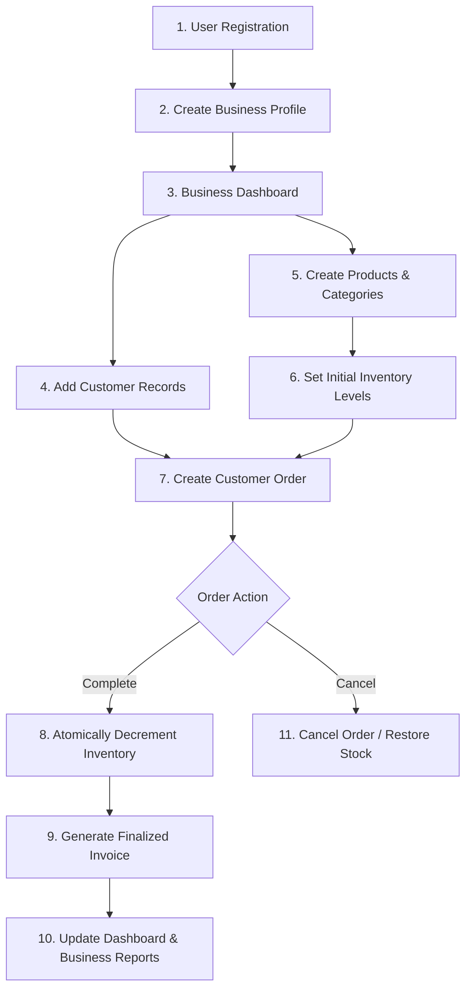
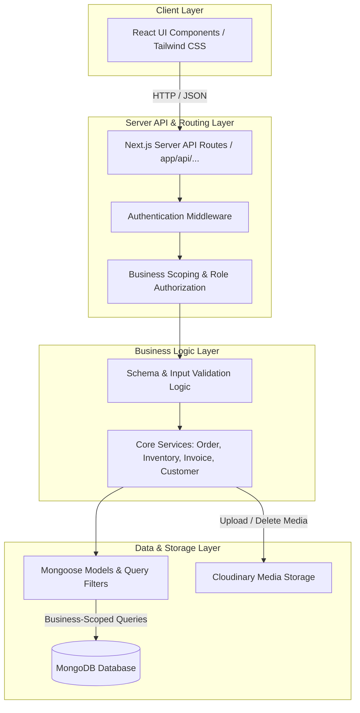
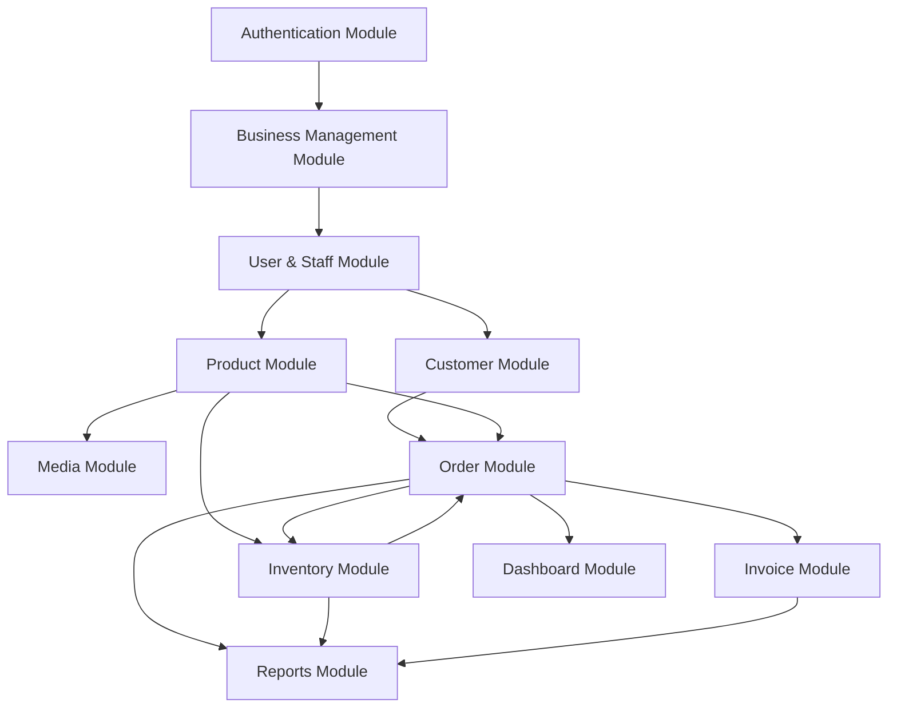
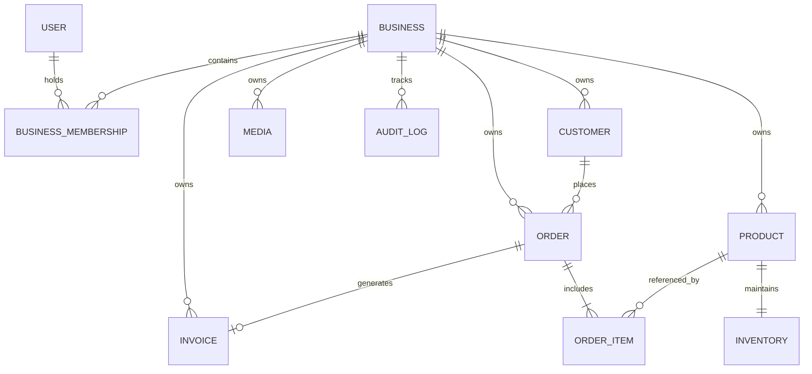
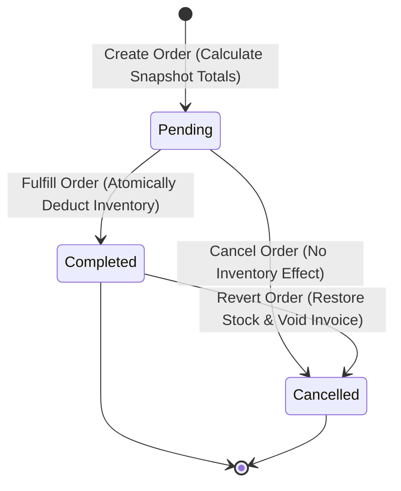
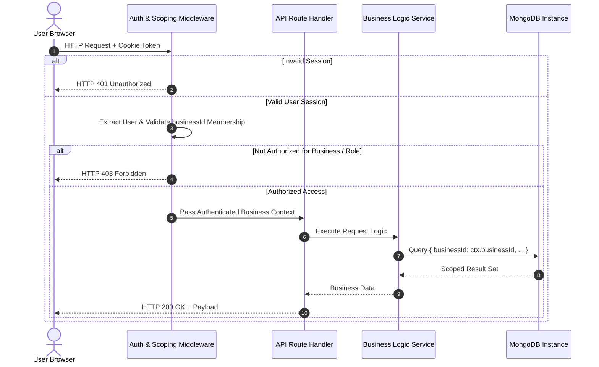
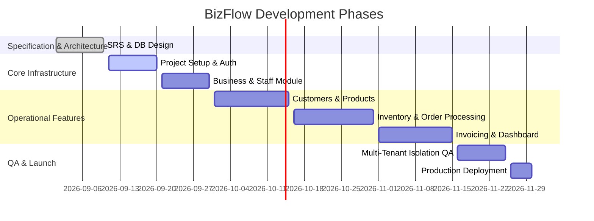

# Software Requirements Specification (SRS)
## BizFlow — Business Management Platform

**Document Version:** 1.0.0  
**Project Type:** Full-Stack Web Application  
**Project Status:** Planning & Architectural Specification  
**Tech Stack:** Next.js, React, TypeScript, Vanilla CSS / Tailwind CSS, MongoDB, Mongoose, Cloudinary  

---

## 1. Introduction

### 1.1 Purpose
This Software Requirements Specification (SRS) document details the complete functional, non-functional, data, architectural, security, and interface requirements for **BizFlow**. It serves as the definitive reference for developers, system architects, and stakeholders before and during implementation.

### 1.2 Scope
BizFlow is a full-stack, multi-tenant web application designed to centralize core daily operations for small and growing businesses. The platform enables independent businesses (e.g., retail, electronics, cosmetics, online stores, service-based businesses, and small agencies) to manage customers, catalog products, track inventory, process orders, and issue invoices within a single system, while ensuring strict logical data isolation between businesses.

### 1.3 Definitions & Acronyms
* **Multi-Tenancy / Business Data Isolation:** Architecture where multiple independent businesses share system infrastructure while keeping their operational data strictly isolated.
* **MVP:** Minimum Viable Product — the baseline functional version required for initial deployment.
* **SRS:** Software Requirements Specification.
* **Business Owner:** User with full operational and administrative privileges within a single business.
* **Staff Member:** User with constrained, configurable operational permissions within a single business.
* **Platform Administrator:** Conceptual system-wide administrator role reserved for future platform maintenance.

### 1.4 Project Objectives
* **Operational Unification:** Connect customer records, product catalogs, real-time inventory tracking, order fulfillment, and invoicing into one seamless workflow.
* **Strict Multi-Tenant Isolation:** Enforce server-side data scoping by `businessId` across all data queries and API endpoints.
* **Role-Based Governance:** Provide granular access control between Business Owners and Staff Members.
* **High Reliability:** Guarantee atomic inventory adjustments upon order status changes to avoid over-selling or stock drift.

---

## 2. Overall Description

### 2.1 Problem Statement & Solution
Small businesses frequently struggle with disconnected tools (spreadsheets, messaging apps, paper records), leading to:
* Out-of-sync inventory counts and stock-outs.
* Fragmented customer records and loss of transaction history.
* Slow, error-prone manual invoicing.
* Unsafe permission sharing where staff members get unrestricted access to sensitive data.

**BizFlow Solution:** A unified platform where businesses manage their complete lifecycle loop. Data remains isolated per business, operations are role-restricted, and stock updates automatically upon order fulfillment.

### 2.2 Core Business Operational Workflow
Every business onboarded to BizFlow follows a continuous operational loop:



### 2.3 User Classes & Characteristics

* **Business Owner:**
  * Highest authority within a specific business.
  * Responsible for business setup, profile settings, staff management, and full access to operational tools, dashboards, and financial reports.
* **Staff Member:**
  * Operational user invited by a Business Owner.
  * Access limited strictly to explicit permissions granted by the Owner (e.g., managing orders or viewing stock).
* **Platform Administrator (Future Scope):**
  * System administrator with platform-level monitoring capabilities; does not interfere with daily business data unless performing authorized maintenance.

### 2.4 Role Permission Matrix

| Operational Capability | Business Owner | Staff Member (Configurable) | Platform Admin (Future) |
| :--- | :---: | :---: | :---: |
| Create & Manage Business Profile | **Yes** | **No** | **No** |
| Invite & Manage Staff / Permissions | **Yes** | **No** | **No** |
| Customer Management (CRUD) | **Yes** | Optional Grant | **No** |
| Product & Category Management | **Yes** | Optional Grant | **No** |
| Inventory Adjustments | **Yes** | Optional Grant | **No** |
| Order Processing & Fulfillment | **Yes** | Optional Grant | **No** |
| Invoice Generation & Export | **Yes** | Optional Grant | **No** |
| View Business Dashboard & Analytics | **Yes** | Optional Grant | **No** |
| Platform-Level System Monitoring | **No** | **No** | **Yes** |
| Access Cross-Business Data | **No** | **No** | Restricted / Audited |

---

## 3. Functional Requirements

### 3.1 Authentication & Session Management
* **REQ-AUTH-01:** System shall support user registration via email and password.
* **REQ-AUTH-02:** System shall securely hash passwords using `bcrypt` (or equivalent algorithm) prior to storage.
* **REQ-AUTH-03:** System shall authenticate user credentials and issue encrypted, HTTP-only session tokens/cookies.
* **REQ-AUTH-04:** Generic error messages shall be returned on failed logins to prevent account enumeration.
* **REQ-AUTH-05:** System shall provide explicit logout mechanisms that invalidate session state.
* **REQ-AUTH-06:** System shall support time-limited, single-use password reset tokens sent via email.

### 3.2 Business Profile Management
* **REQ-BIZ-01:** Authenticated users without a business shall be directed to create a business profile (Name, Type, Currency, Contact details).
* **REQ-BIZ-02:** The registering user automatically becomes the **Business Owner**.
* **REQ-BIZ-03:** Every business-scoped resource (Customer, Product, Inventory, Order, Invoice, Media) must reference exactly one valid `businessId`.
* **REQ-BIZ-04:** Only Business Owners may modify profile details and business configuration settings.

### 3.3 User & Staff Management
* **REQ-STAFF-01:** Business Owners shall be able to invite or add Staff Members using their email.
* **REQ-STAFF-02:** Business Owners shall grant granular permissions (e.g., `canManageOrders`, `canViewReports`) to Staff Members.
* **REQ-STAFF-03:** Staff Members shall not self-elevate permissions or manage other staff accounts.
* **REQ-STAFF-04:** Removing a Staff Member immediately revokes their access to the business without corrupting historical transaction logs created by them.

### 3.4 Customer Management
* **REQ-CUST-01:** System shall support Create, Read, Update, and Deactivate/Archive operations for customer records.
* **REQ-CUST-02:** Customer records must store contact details, addresses, notes, and link to their purchase history.
* **REQ-CUST-03:** Customer records referenced in existing orders cannot be hard-deleted; they must be deactivated/archived.
* **REQ-CUST-04:** Customer search and filtering (by name, phone, email) must strictly operate within the active business context.

### 3.5 Product Management
* **REQ-PROD-01:** System shall allow authorized users to manage product records (Title, Description, Category, Price, Media references).
* **REQ-PROD-02:** Products referenced by existing orders cannot be hard-deleted; they must be archived to protect order history integrity.
* **REQ-PROD-03:** Product price modifications apply solely to future orders; historical order/invoice prices must remain unchanged.

### 3.6 Inventory Management
* **REQ-INV-01:** Each product must have a corresponding inventory stock level and optional low-stock threshold.
* **REQ-INV-02:** Inventory adjustments (manual stock setting vs. automated order deductions) must be tracked.
* **REQ-INV-03:** Transitioning an order to **Completed** must automatically and atomically decrement stock for all line items.
* **REQ-INV-04:** Completing an order that exceeds available stock must be blocked unless an explicit backorder override rule is enabled.

### 3.7 Order Management
* **REQ-ORD-01:** Orders must link a customer to one or more business products with fixed snapshot prices and quantities.
* **REQ-ORD-02:** Supported order lifecycle states: `Pending`, `Completed`, `Cancelled`.
* **REQ-ORD-03:** Orders must reject line items belonging to other businesses or non-existent items.
* **REQ-ORD-04:** Cancelling a `Completed` order triggers an automated reversal flow that restores stock quantities and flags associated invoices.

### 3.8 Invoice Management
* **REQ-INV-01:** Invoices can only be generated for orders in a `Completed` state.
* **REQ-INV-02:** Each order permits at most one active finalized invoice.
* **REQ-INV-03:** Finalized invoice financial totals are immutable; corrections require credit notes or explicit reissue procedures.
* **REQ-INV-04:** Invoices must be exportable/downloadable (e.g., formatted PDF or printable view).

### 3.9 Dashboard & Business Analytics
* **REQ-DASH-01:** Authenticated users shall access a real-time dashboard displaying key business metrics (Recent Orders, Revenue Overview, Low-Stock Alerts).
* **REQ-DASH-02:** Dashboard widgets must filter content dynamically based on the active user's permissions.

### 3.10 Reports & Media Management
* **REQ-REP-01:** System shall generate sales, inventory turnover, and order activity reports over customizable date ranges.
* **REQ-MEDIA-01:** Media uploads (e.g., product images) shall be validated for file size/type before uploading to external cloud storage (Cloudinary).
* **REQ-MEDIA-02:** Media records shall be bound to `businessId` to prevent unauthorized file access across businesses.

---

## 4. System Architecture & High-Level Design

### 4.1 Layered Architecture Overview
BizFlow utilizes a Next.js full-stack architecture with strict server-side validation and multi-tenant scoping before any database execution:



### 4.2 Module Dependency Diagram



### 4.3 Technology Stack

* **Frontend Framework:** Next.js (App Router), React, TypeScript.
* **Styling:** Vanilla CSS / Tailwind CSS (Responsive Design System).
* **Backend Runtime:** Next.js Server & API Routes (Full-Stack Unified Runtime).
* **Database Layer:** MongoDB with Mongoose Object Data Modeling (ODM).
* **Media Management:** Cloudinary API integration.
* **Deployment & Hosting:** Vercel platform with automated CI/CD integration.

---

## 5. Data Requirements & Database Schema

### 5.1 Multi-Tenancy Strategy
All operational collections in MongoDB incorporate a mandatory `businessId` reference. Every Mongoose query executed by the application automatically appends `{ businessId: activeSession.businessId }` to guarantee data isolation.

### 5.2 Logical Entity Specifications

* **User:** `_id`, `email` (unique), `passwordHash`, `name`, `status`, `createdAt`.
* **Business:** `_id`, `name`, `ownerId` (ref: User), `currency`, `businessType`, `createdAt`.
* **BusinessMembership:** `_id`, `userId` (ref: User), `businessId` (ref: Business), `role` (Owner|Staff), `permissions` (Array), `createdAt`.
* **Customer:** `_id`, `businessId` (ref: Business), `name`, `email`, `phone`, `address`, `status` (Active|Archived), `createdAt`.
* **Product:** `_id`, `businessId` (ref: Business), `name`, `description`, `category`, `price`, `mediaUrls` (Array), `status` (Active|Archived), `createdAt`.
* **Inventory:** `_id`, `businessId` (ref: Business), `productId` (ref: Product, unique), `quantity`, `lowStockThreshold`, `updatedAt`.
* **Order:** `_id`, `businessId` (ref: Business), `customerId` (ref: Customer), `items` (Array of embedded OrderItems), `totalAmount`, `status` (Pending|Completed|Cancelled), `createdAt`.
* **OrderItem (Embedded):** `productId` (ref: Product), `quantity`, `unitPriceAtOrder`.
* **Invoice:** `_id`, `businessId` (ref: Business), `orderId` (ref: Order, unique), `invoiceNumber`, `totalAmount`, `status` (Issued|Voided), `issuedAt`.
* **Media:** `_id`, `businessId` (ref: Business), `publicId`, `url`, `mimeType`, `uploadedAt`.
* **AuditLog:** `_id`, `businessId` (ref: Business), `userId` (ref: User), `action`, `details`, `timestamp`.

### 5.3 Entity Relationship Diagram (ERD)



### 5.4 Indexing & Soft-Delete Strategy
* **Compound Indexing:** All collections enforce compound indexes on `{ businessId: 1, _id: 1 }` and `{ businessId: 1, status: 1 }`.
* **Uniqueness:** Unique indexes on `User.email`, `{ businessId: 1, productId: 1 }` in Inventory, and `orderId` in Invoice.
* **Archiving Strategy:** Customers and Products set `status: 'Archived'` rather than executing physical `DELETE` queries when historical dependencies exist.

---

## 6. Business Rules & Access Control Logic

### 6.1 Order & Inventory State Transition Rules



* **RULE-01 (Inventory Deduction):** Stock is decremented only upon moving an order to `Completed`.
* **RULE-02 (Insufficient Stock):** An order cannot complete if `Product.quantity < RequestedQuantity`, unless an authorized backorder exception applies.
* **RULE-03 (Price Snapshotting):** Line items capture unit price at the time of order creation; subsequent product price updates do not change historical orders or invoices.
* **RULE-04 (Invoice Immutability):** Invoices generated for completed orders cannot be directly edited. Reversals require voiding the invoice.
* **RULE-05 (Cross-Business Rejection):** Orders cannot reference products or customers associated with a different `businessId`.

---

## 7. External Interface Requirements

### 7.1 User Interface (UI/UX) Requirements
* **Application Shell:** Sidebar navigation rendering modules based on user permissions.
* **State Feedback:**
  * **Loading States:** Skeleton loaders for table rows and cards during API fetch.
  * **Empty States:** Actionable placeholders when lists (Customers, Products, Orders) return 0 items.
  * **Error Alerts:** User-friendly toast notifications and inline form validation hints.
  * **Confirmations:** Modal dialogs for destructive actions (Archiving products, cancelling orders).
* **Responsive Layout:** Adaptive layouts supporting Mobile, Tablet, and Desktop screen widths.

### 7.2 Core REST API Specifications Summary

| Endpoint | Method | Role / Permission Required | Description |
| :--- | :---: | :--- | :--- |
| `/api/auth/register` | `POST` | Public | Register user account |
| `/api/auth/login` | `POST` | Public | Authenticate user & set session cookie |
| `/api/businesses` | `POST` | Authenticated User | Create business & become Owner |
| `/api/businesses/:id/staff` | `GET/POST` | Business Owner | Manage staff list and permissions |
| `/api/businesses/:id/customers` | `GET/POST` | `canManageCustomers` | List / create customer records |
| `/api/businesses/:id/products` | `GET/POST` | `canManageProducts` | Catalog product entries |
| `/api/businesses/:id/inventory` | `GET/PATCH`| `canManageInventory` | View / adjust stock levels |
| `/api/businesses/:id/orders` | `GET/POST` | `canManageOrders` | Create / list customer orders |
| `/api/businesses/:id/orders/:id/status` | `PATCH` | `canManageOrders` | Update order state (Complete/Cancel) |
| `/api/businesses/:id/invoices` | `GET/POST` | `canManageInvoices` | Generate invoice from completed order |
| `/api/businesses/:id/dashboard` | `GET` | Authenticated Member | Fetch business metrics summary |
| `/api/businesses/:id/reports` | `GET` | `canViewReports` | Export sales & stock activity data |

### 7.3 API Standard Response & Error Format

All responses follow a predictable JSON contract:

```json
{
  "success": true,
  "data": {},
  "meta": { "page": 1, "limit": 20, "total": 150 }
}
```

Standard Error Contract:
```json
{
  "success": false,
  "error": {
    "code": "INSUFFICIENT_STOCK",
    "message": "Selected product line item exceeds available inventory.",
    "details": [
      { "field": "quantity", "issue": "Available stock is 3, requested 5" }
    ]
  }
}
```

---

## 8. Authentication & Authorization Security Flow

### 8.1 Request Pipeline Architecture



---

## 9. Non-Functional Requirements (NFRs)

### 9.1 Performance & Scalability
* **API Latency:** Core REST API endpoints shall respond within **< 500ms** under normal load.
* **Dashboard Aggregation:** Summary analytics queries shall complete within **< 2.0s** for datasets up to 10,000 orders.
* **Concurrency Support:** System architecture must support at least **100+ active businesses** concurrently without data leakage or performance degradation.
* **Pagination:** All list endpoints must enforce pagination (default page size: 20, maximum limit: 100).

### 9.2 Security & Data Privacy
* **Encryption in Transit:** All production web traffic enforced via **HTTPS** (TLS 1.3).
* **Data Scoping:** Business isolation enforced at database query layer; never relies solely on client-side filtering.
* **Secret Protection:** Database credentials and API keys managed exclusively via environment variables (`.env`).
* **Input Sanitization:** API payloads sanitized to prevent NoSQL injection and XSS vulnerabilities.

### 9.3 Reliability & Atomic Integrity
* **Atomic Transactions:** Stock updates linked with order state changes execute within MongoDB sessions/transactions to prevent partial state writes.
* **Uptime Target:** System targets **99.0% availability**, excluding scheduled maintenance.

---

## 10. System Workflows & User Scenarios

### 10.1 Order Fulfillment & Invoicing User Flow
1. Staff Member opens **Order Creation** page and selects a business customer.
2. Staff selects products, specifying quantities; system checks current stock levels.
3. System saves order with status `Pending`.
4. Authorized staff clicks **Mark as Completed**.
5. System verifies inventory levels:
   * **If insufficient stock:** Transaction halts, displays error message.
   * **If stock sufficient:** Inventory is atomically decremented, order status set to `Completed`.
6. Staff clicks **Generate Invoice**.
7. System generates an immutable invoice record with line items snapshotting the completed order details.
8. Staff downloads/prints the invoice for customer billing.

---

## 11. Error & Edge Case Management

| Exception Scenario | System Detection | Recovery / User Result |
| :--- | :--- | :--- |
| **Invalid Login Credentials** | Hash mismatch on authentication | Return generic `"Invalid email or password"` error. |
| **Insufficient Inventory** | Order completion stock check fails | Block status change, display product stock shortfall details. |
| **Duplicate Customer Email** | Unique index check or validation hook | Highlight form field with inline warning message. |
| **Out-of-Sequence Order Transition** | Attempt to complete a `Cancelled` order | Reject API request with HTTP `409 Conflict`. |
| **Media Upload Failure** | Cloudinary service unreachable | Abort image assignment, leave original product record intact. |
| **Expired User Session** | Token validation check fails | Redirect browser to Login page with session expiration alert. |
| **Cross-Business ID Access** | Request payload includes external `businessId` | Return HTTP `404 Not Found` to prevent entity probing. |

---

## 12. Quality Assurance & Testing Requirements

### 12.1 Testing Strategy Breakdown
* **Unit Testing:** Validate isolated business rules (price snapshot calculations, stock threshold checks).
* **Integration Testing:** Test database service operations against a test MongoDB instance.
* **Multi-Business Isolation Testing (Critical):** Dedicated test suite ensuring User of Business A is strictly barred from reading or mutating data of Business B across all API endpoints.
* **API End-to-End Testing:** Automate verification of full operational loops (Register → Setup Business → Add Products → Order → Complete → Invoice).

### 12.2 Definition of Done (DoD) Criteria
A feature is considered complete only when:
1. All functional requirements and business rules are satisfied without shortcuts.
2. Server-side validation and business data isolation checks are enforced.
3. Responsive UI with loading, empty, and error states is rendered.
4. Corresponding unit, integration, and security tests pass cleanly.
5. No TypeScript compiler or linter errors remain.

---

## 13. Deployment & Infrastructure Requirements

### 13.1 Hosting & Deployment Setup
* **App Hosting:** Deployed on **Vercel** platform, taking advantage of Next.js serverless route optimizations.
* **Database Hosting:** Managed **MongoDB Atlas** cluster with auto-scaling storage.
* **Media Assets:** External cloud asset management via **Cloudinary**.
* **Environment Separation:** Isolated database URIs and secrets between `development`, `staging`, and `production` environments.
* **Backup & Recovery:** Daily automated database backups with a documented point-in-time recovery procedure.

---

## 14. Project Roadmap & Development Phases



### 14.1 Future Scope (Post-MVP Roadmap)
* **Online Payment Gateway:** Stripe integration for direct invoice payment processing.
* **Customer Storefront:** Public online ordering catalog for end-customers.
* **Multi-Business Account Switcher:** Unified login allowing users to seamlessly switch between multiple owned businesses.
* **Advanced Analytics:** AI-driven reorder forecasting and automated stock low-level reordering alerts.